# Basis Data Terdistribusi
ETS Basis Data Terdistribusi

<!-- ## Daftar Isi
  - [Desain dan Implementasi Infrastuktur](#poin1) -->

## 1. Desain dan Implementasi Infrastruktur

### a. Desain Infrastruktur

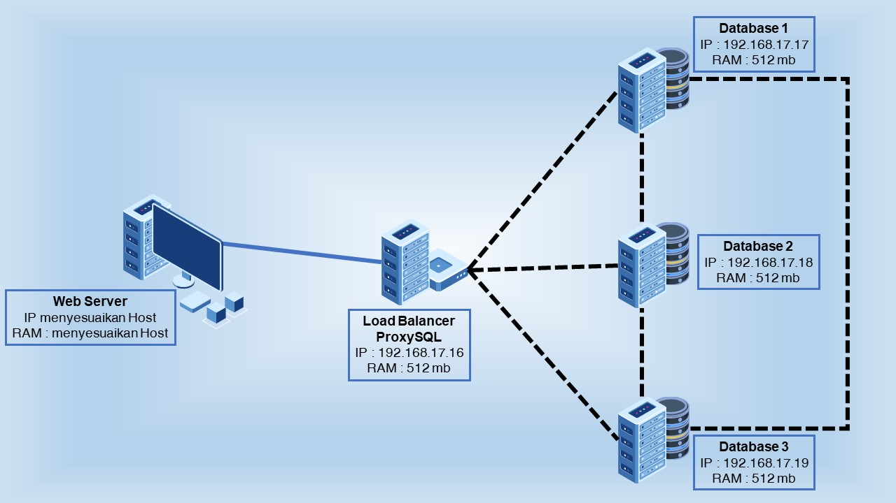

### Database Server
* Database 1
  * RAM: 512 MB
  * OS: Ubuntu 16.04
  * IP: 192.168.17.17
* Database 2
  * RAM: 512 MB
  * OS: Ubuntu 16.04
  * IP: 192.168.17.18
* Database 3
  * RAM: 512 MB
  * OS: Ubuntu 16.04
  * IP: 192.168.17.19

### Load Balancer
* ProxySQL
  * RAM: 512 MB
  * OS: Ubuntu 16.04
  * IP: 192.168.17.16

### b. Implementasi Infrastruktur
* Proses Instalasi
  * Aplikasi yang dibutuhkan :
    * Vagrant
    * Virtual Box
* Tahapan Konfigurasi  
Instalasi Basis Data Terdistribusi memanfaatkan provisioning dengan menggunakan Vagrant.  
  * **Langkah Pertama**  
    Membuat Vagrant File
    ```ruby
    Vagrant.configure("2") do |config|
        (1..3).each do |i|
            config.vm.define "db#{i}" do |node|
            node.vm.hostname = "db#{i}"
            node.vm.box = "bento/ubuntu-16.04"
            node.vm.network "private_network", ip: "192.168.17.#{i+16}"

            node.vm.provider "virtualbox" do |vb|
                vb.name = "db#{i}"
                vb.gui = false
                vb.memory = "1024"
            end

            node.vm.provision "shell", path: "deployMySQL1#{i}.sh", privileged: false
            end
        end

        config.vm.define "proxy" do |proxy|
            proxy.vm.hostname = "proxy"
            proxy.vm.box = "bento/ubuntu-16.04"
            proxy.vm.network "private_network", ip: "192.168.17.16"

            proxy.vm.provider "virtualbox" do |vb|
            vb.name = "proxy"
            vb.gui = false
            vb.memory = "512"
            end

            proxy.vm.provision "shell", path: "deployProxySQL.sh", privileged: false
        end

    end

    ```
  * **Langkah Kedua**  
  Node-node dibuat di dalam Virtual Box. Provision diletakkan pada file terpisah untuk mempermudah setting dan pembacaan.  
  - Setting Database :  
  [Provision Database 1](deployMySQL11.sh)  
  [Provision Database 2](deployMySQL12.sh)  
  [Provision Database 3](deployMySQL13.sh)  
  Pada Database akan dilakukan instalasi mySQL dan dilakukan tambahan file config.  
  [Config Database 1](my11.cnf)  
  [Config Database 1](my12.cnf)  
  [Config Database 1](my13.cnf)  
  Selain itu juga ada tambahan file setting dalam bentuk sql untuk beberapa keperluan  
  Dijalankan di Database 1  
  [Cluster Bootstrap](cluster_bootstrap.sql) : Untuk mengatur Replication User dan mengaktifkan Plugin Group Replication. (Sekaligus memulai Group Replication)   
  [Addition to System](addition_to_sys.sql) : Untuk mengatur Monitoring  
  [Create ProxySQL User](create_proxysql_user.sql) : Untuk membuat user yang akan digunakan di ProxySQL  
  Dijalankan di Database 2 dan Database 3  
  [Cluster Member](cluster_member.sql) : Untuk mengatur Replication User dan mengaktifkan Plugin Group Replication   
  - Setting Proxy :  
  [Provision ProxySQL](deployProxySQL.sh)  
  File setting tambahan  
  [Konfigurasi ProxySQL](proxysql.sql) : Untuk mengatur node MySQL  

  * **Langkah Ketiga**  
  Untuk menjalankan Vagrant File cukup dengan command _vagrant up_  pada direktori kerja
    ```
    vagrant up
    ```
    Contoh :
    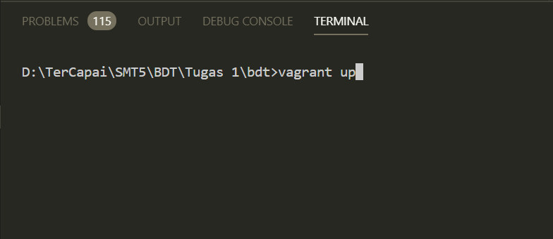
    Setelah itu pastikan di Virtual Box node-node yang   dibuat di atas telah berjalan
    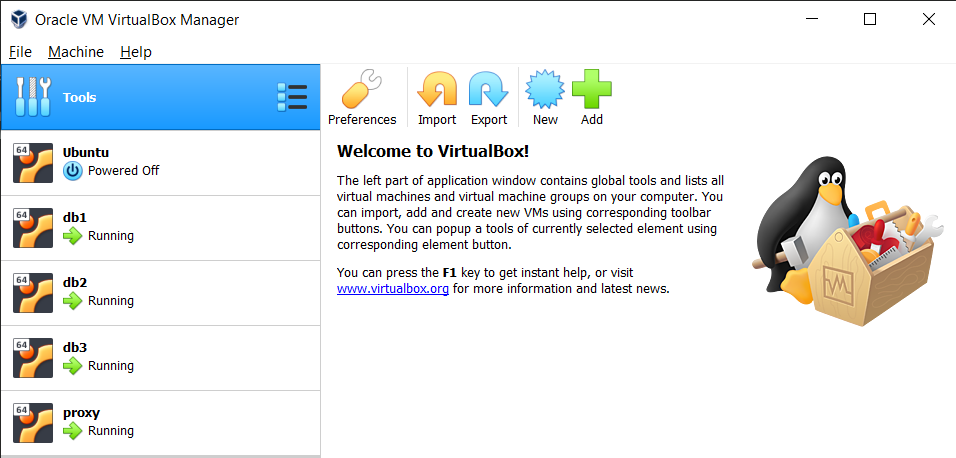
    Lakukan pengecekan dengan menggunakan SSH Vagrant,   default username dan password 'vagrant'
    ```
    vagrant ssh (nama node)
    ```
    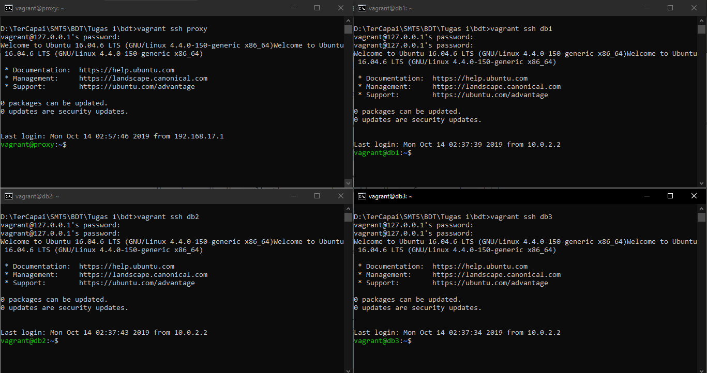
    Masuk ke MySQL Database dengan command
    ```
    mysql -u root -padmin
    ```
    Masuk ke ProxySQL dengan command
    ```bash
    mysql -u admin -ppassword -h 127.0.0.1 -P 6032   --prompt='ProxySQLAdmin> '
    ```
    Pada Database 1 jalankan Group Replication
    ```sql
    SET GLOBAL group_replication_bootstrap_group=ON;
    START GROUP_REPLICATION;
    SET GLOBAL group_replication_bootstrap_group=OFF;
    ```
    Pada Database 2 dan Database 3
    ```sql
    START GROUP_REPLICATION;
    ```
    Lakukan testing untuk melihat node yang aktif   dengan command
    ```sql
    SELECT * FROM   performance_schema.replication_group_members;
    ```
    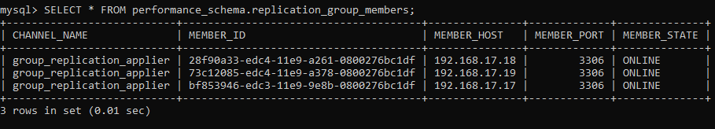
    Lakukan testing pada ProxySQL dengan command
    ```sql
    SELECT hostgroup_id, hostname, status FROM   runtime_mysql_servers;
    ```
    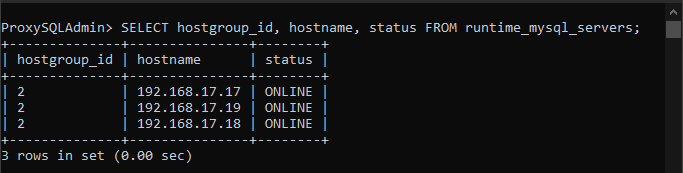

## 2. Penggunaan Basis Data Terdistribusi

### ab. Instalasi dan Konfigurasi Aplikasi Tambahan
Karena menggunakan xampp, jadi untuk aplikasi tambahannya tinggal melakukan instalasi xampp  
Untuk aplikasi instalasi yang dipakai, langkah-langkah :
* Masuk ke direktori htdocs xampp
* Clone repository aplikasi
```
git clone https://github.com/ersadishla/titip
```
* Pindah direktori, kemudian install dan dump Composer
```
composer install
composer dump-autoload
```
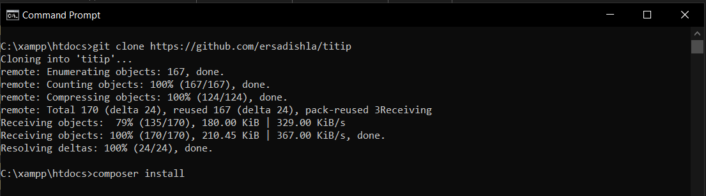
* Salin file _.env.example_ menjadi _.env_ untuk melakukan konfigurasi
* Generate Key
```
php artisan key:generate
```
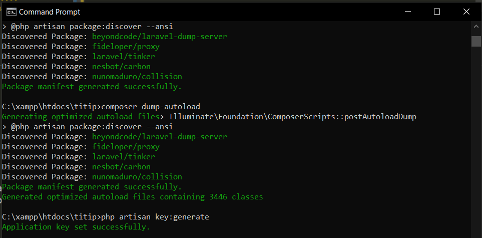
### c. Deskripsi Aplikasi
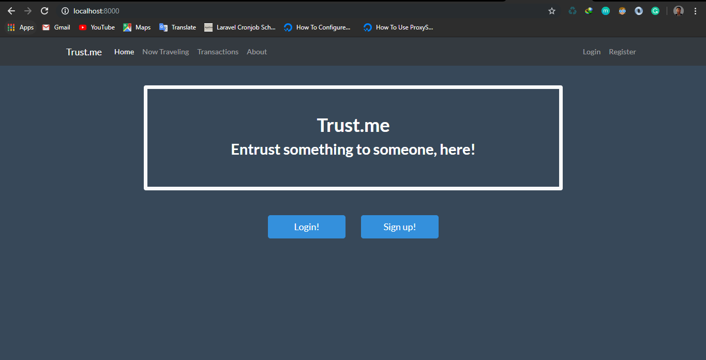
trust(dot)me adalah aplikasi sederhana yang menjawab masalah orang yang tinggal di asrama ITS yang tidak mempunyai transportasi ataupun yang malas untuk pergi ke suatu tempat. trust(dot)me menyediakan platform untuk orang yang mau pergi ke suatu tempat untuk melakukan postingan di website terlebih dahulu, dengan mencantumkan waktu keberangkatan dan tujuan. Kemudian bagi orang yang ingin titip sesuatu tinggal memilih yang tujuannya sesuai.  

Tampilan ketika menambahkan kepergian ke suatu tempat
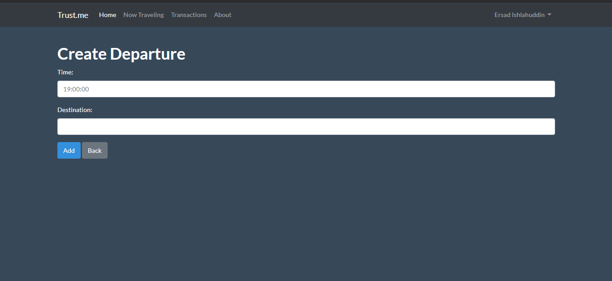
Tampilan list orang yang pergi ke suatu tempat  
Tampilan yang berangkat
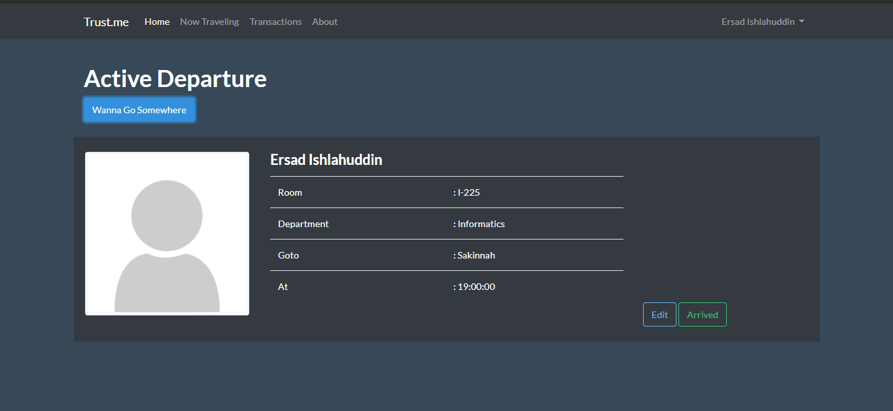
Tampilan orang lain
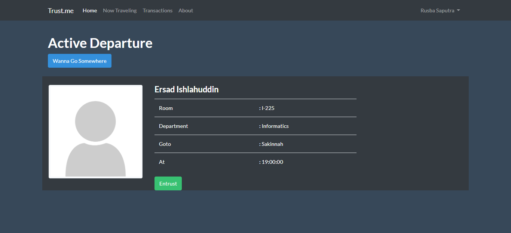
Tampilan ketika titip ke seseorang

Tampilan dashboard orang yang pergi
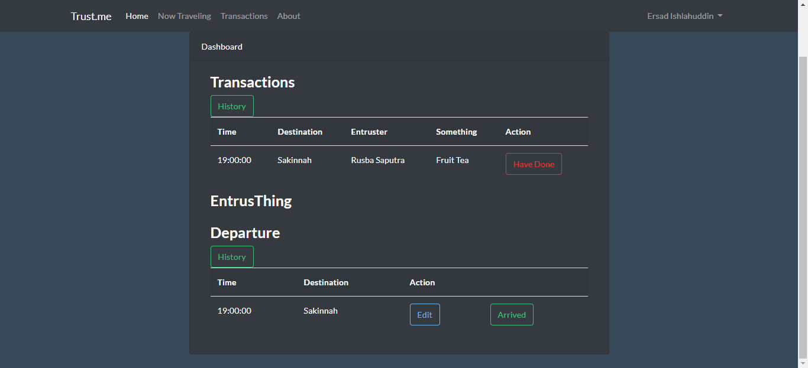
Tampilan dashboard orang yang titip
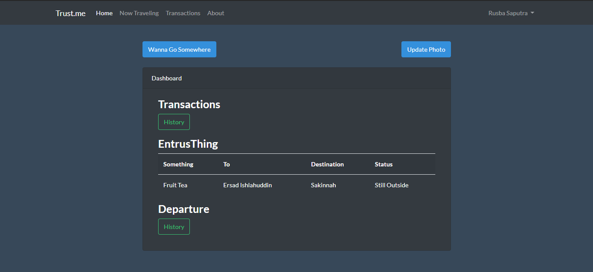
### d. Konfigurasi Aplikasi untuk menggunakan BDT
Sebelum mulai konfigurasi aplikasi, ada tambahan konfigurasi untuk database  
**Dijalankan di Database 1**
* Buat database baru
```sql
CREATE DATABASE bdt;
```
* Buat user MySQL baru
```sql
CREATE USER 'bdtuser'@'%' IDENTIFIED BY 'bdtpassword';
GRANT ALL PRIVILEGES on bdt.* to 'bdtuser'@'%';
FLUSH PRIVILEGES;
EXIT;
```
* Testing
```
mysql -u bdtuser -pbdtpassword
```
**Dijalankan di ProxySQL**
* Masuk ke ProxySQL
```
mysql -u admin -ppassword -h 127.0.0.1 -P 6032 --prompt='ProxySQLAdmin> '
```
* Tambah User MySQL
```sql
INSERT INTO mysql_users(username, password, default_hostgroup) VALUES ('bdtuser', 'bdtpassword', 2);
```
* Migrate dan Simpan ke Disk
```sql
LOAD MYSQL USERS TO RUNTIME;
SAVE MYSQL USERS TO DISK;
```
**Konfigurasi Aplikasi**
* Setting .env
Ubah DB_HOST menjadi alamat IP ProxySQL, DB_PORT menjadi 6033, sisanya menyesuaikan
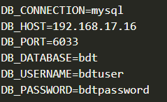
* Migration dan Seeding(kalau ada)
```
php artisan migrate
php artisan db:seed
```
* Jalankan Aplikasi di lokal
```
php artisan serve
```
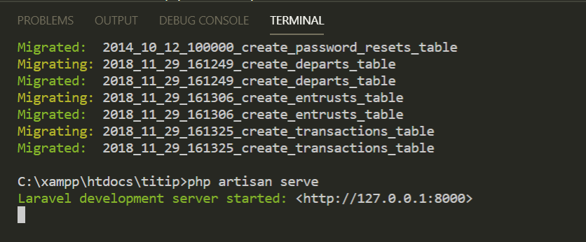
* Testing
Di browser buka url http://localhost:8000/


## 3. Simulasi Fail-Over

### a. Matikan salah satu Database
```
sudo service mysql stop
```
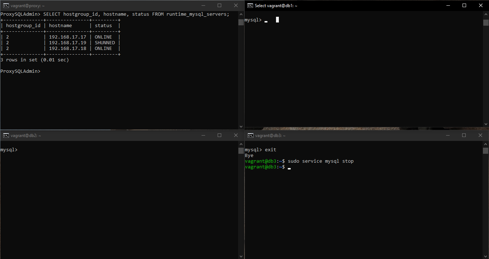
### b. Tunjukkan bahwa aplikasi tetap berjalan dengan baik
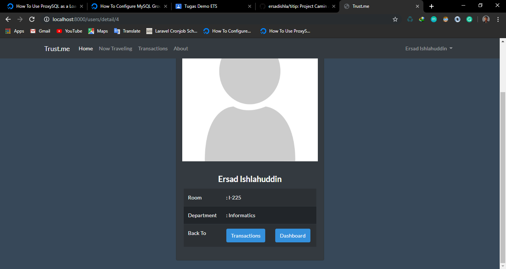
Testing dengan input data baru (menambahkan rencana kepergian)
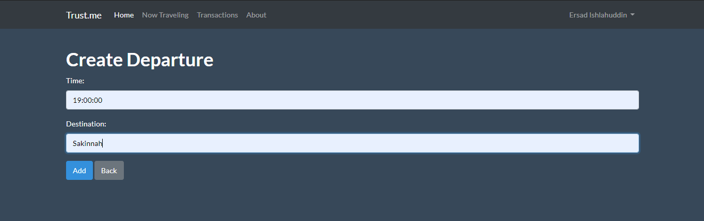
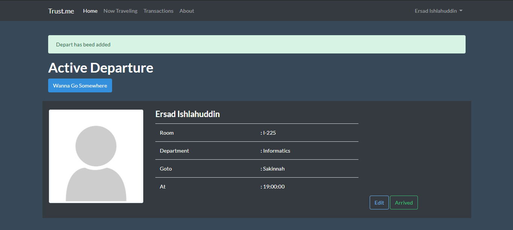
Testing di database
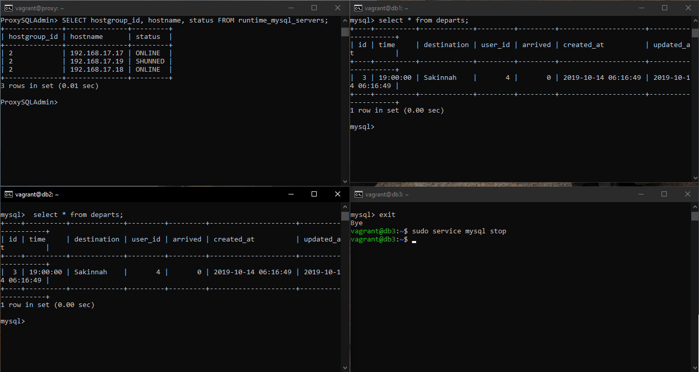
### c. Jalankan server yang sebelumnya mati
```
sudo service mysql start
```
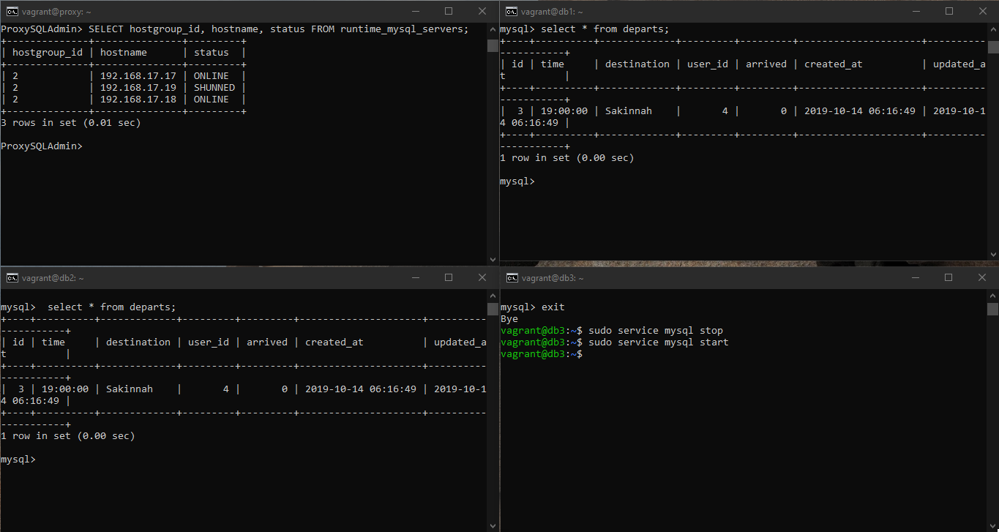
### d. Tunjukkan bahwa server yang sebelumnya mati punya data yang sama
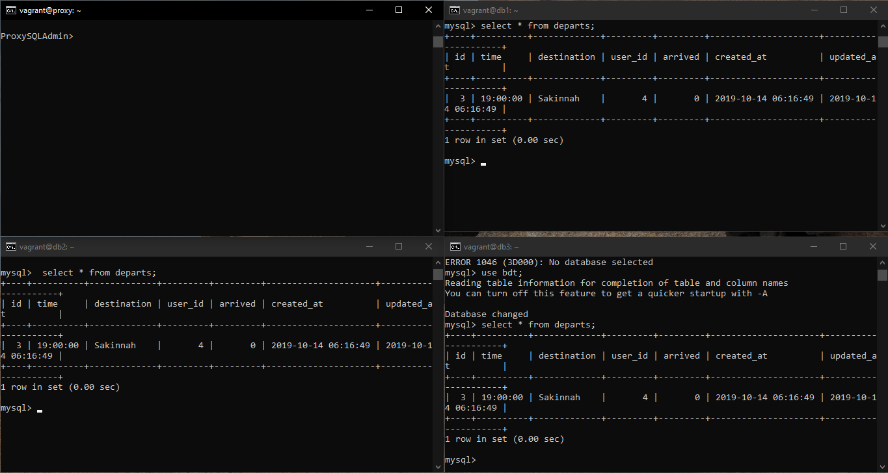