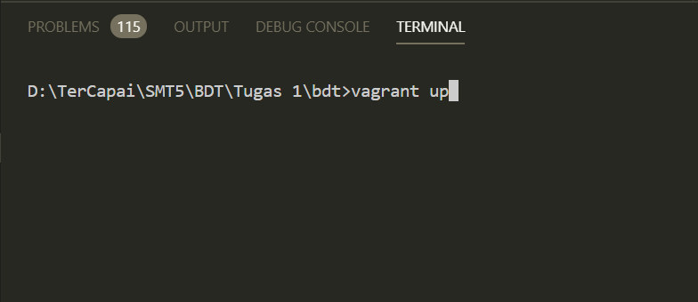
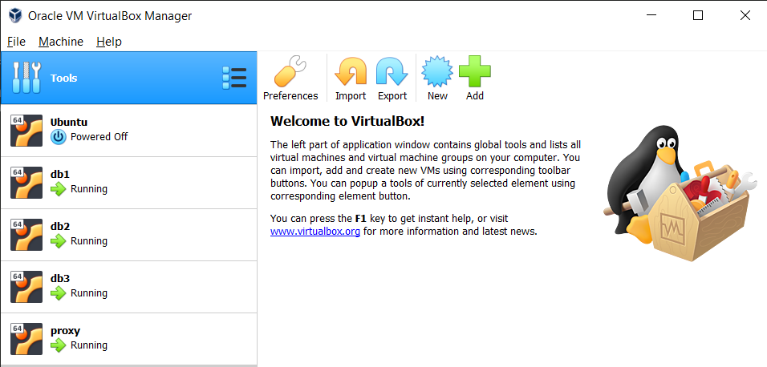
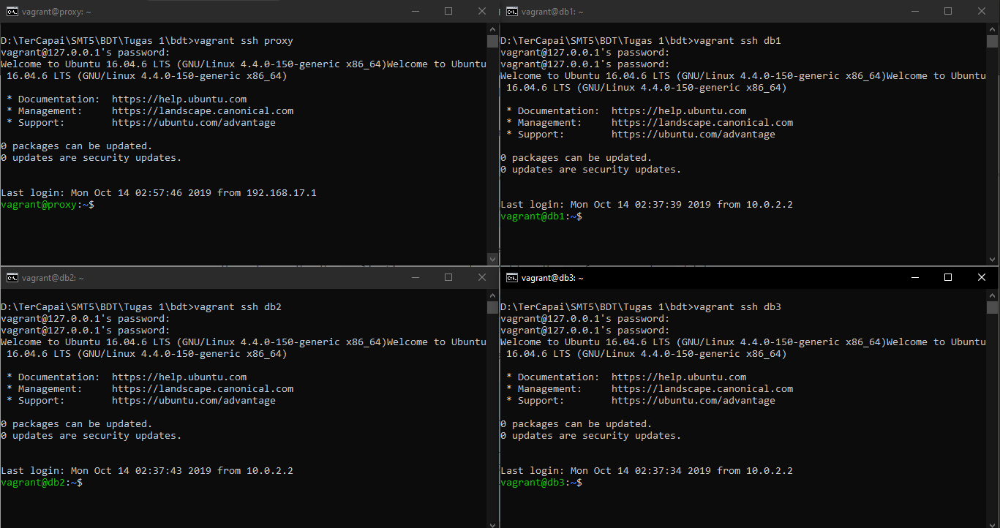
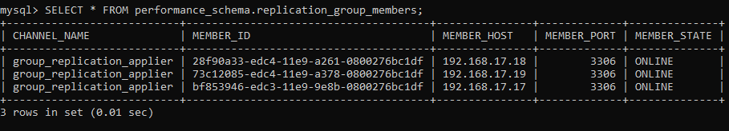
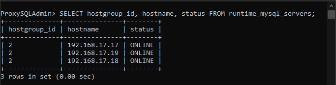

# Basis Data Terdistribusi
ETS Basis Data Terdistribusi

<!-- ## Daftar Isi
  - [Desain dan Implementasi Infrastuktur](#poin1) -->

## 1. Desain dan Implementasi Infrastruktur

### a. Desain Infrastruktur


### Database Server
* Database 1
  * RAM: 512 MB
  * OS: Ubuntu 16.04
  * IP: 192.168.17.17
* Database 2
  * RAM: 512 MB
  * OS: Ubuntu 16.04
  * IP: 192.168.17.18
* Database 3
  * RAM: 512 MB
  * OS: Ubuntu 16.04
  * IP: 192.168.17.19

### Load Balancer
* ProxySQL
  * RAM: 512 MB
  * OS: Ubuntu 16.04
  * IP: 192.168.17.16

### b. Implementasi Infrastruktur
* Proses Instalasi
  * Aplikasi yang dibutuhkan :
    * Vagrant
    * Virtual Box
* Tahapan Konfigurasi  
Instalasi Basis Data Terdistribusi memanfaatkan provisioning dengan menggunakan Vagrant.  
  * **Langkah Pertama**  
    Membuat Vagrant File
    ```ruby
    Vagrant.configure("2") do |config|
        (1..3).each do |i|
            config.vm.define "db#{i}" do |node|
            node.vm.hostname = "db#{i}"
            node.vm.box = "bento/ubuntu-16.04"
            node.vm.network "private_network", ip: "192.168.17.#{i+16}"

            node.vm.provider "virtualbox" do |vb|
                vb.name = "db#{i}"
                vb.gui = false
                vb.memory = "1024"
            end

            node.vm.provision "shell", path: "deployMySQL1#{i}.sh", privileged: false
            end
        end

        config.vm.define "proxy" do |proxy|
            proxy.vm.hostname = "proxy"
            proxy.vm.box = "bento/ubuntu-16.04"
            proxy.vm.network "private_network", ip: "192.168.17.16"

            proxy.vm.provider "virtualbox" do |vb|
            vb.name = "proxy"
            vb.gui = false
            vb.memory = "512"
            end

            proxy.vm.provision "shell", path: "deployProxySQL.sh", privileged: false
        end

    end

    ```
  * **Langkah Kedua**  
  Node-node dibuat di dalam Virtual Box. Provision diletakkan pada file terpisah untuk mempermudah setting dan pembacaan.  
  - Setting Database :  
  [Provision Database 1](deployMySQL11.sh)  
  [Provision Database 2](deployMySQL12.sh)  
  [Provision Database 3](deployMySQL13.sh)  
  Pada Database akan dilakukan instalasi mySQL dan dilakukan tambahan file config.  
  [Config Database 1](my11.cnf)  
  [Config Database 1](my12.cnf)  
  [Config Database 1](my13.cnf)  
  Selain itu juga ada tambahan file setting dalam bentuk sql untuk beberapa keperluan  
  Dijalankan di Database 1  
  [Cluster Bootstrap](cluster_bootstrap.sql) : Untuk mengatur Replication User dan mengaktifkan Plugin Group Replication. (Sekaligus memulai Group Replication)   
  [Addition to System](addition_to_sys.sql) : Untuk mengatur Monitoring  
  [Create ProxySQL User](create_proxysql_user.sql) : Untuk membuat user yang akan digunakan di ProxySQL  
  Dijalankan di Database 2 dan Database 3  
  [Cluster Member](cluster_member.sql) : Untuk mengatur Replication User dan mengaktifkan Plugin Group Replication   
  - Setting Proxy :  
  [Provision ProxySQL](deployProxySQL.sh)  
  File setting tambahan  
  [Konfigurasi ProxySQL](proxysql.sql) : Untuk mengatur node MySQL  

  * **Jalankan Vagrant File**  
  Untuk menjalankan Vagrant File cukup dengan command _vagrant up_  pada direktori kerja
    ```
    vagrant up
    ```
    Contoh :
    
    Setelah itu pastikan di Virtual Box node-node yang   dibuat di atas telah berjalan
    
    Lakukan pengecekan dengan menggunakan SSH Vagrant,   default username dan password 'vagrant'
    ```
    vagrant ssh (nama node)
    ```
    
    Masuk ke MySQL Database dengan command
    ```
    mysql -u root -padmin
    ```
    Masuk ke ProxySQL dengan command
    ```bash
    mysql -u admin -ppassword -h 127.0.0.1 -P 6032   --prompt='ProxySQLAdmin> '
    ```
    Pada Database 1 jalankan Group Replication
    ```sql
    SET GLOBAL group_replication_bootstrap_group=ON;
    START GROUP_REPLICATION;
    SET GLOBAL group_replication_bootstrap_group=OFF;
    ```
    Pada Database 2 dan Database 3
    ```sql
    START GROUP_REPLICATION;
    ```
    Lakukan testing untuk melihat node yang aktif   dengan command
    ```sql
    SELECT * FROM   performance_schema.replication_group_members;
    ```
    
    Lakukan testing pada ProxySQL dengan command
    ```sql
    SELECT hostgroup_id, hostname, status FROM   runtime_mysql_servers;
    ```
    